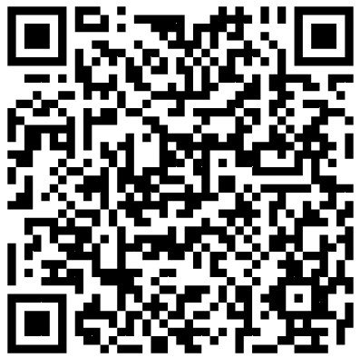
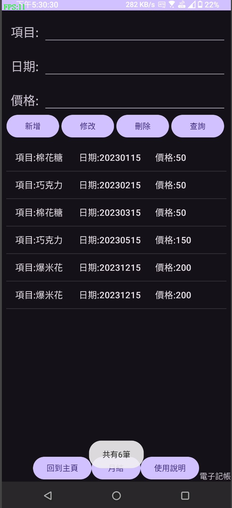

# 112-1-mmslab-java-final-project
我們設計了一個實用的APP給健忘且不想常常算錢的大學生用

(P.S.由於程式內塞了小彩蛋的原因，HTML的比例才會高達99%。實際上功能實現都是靠JAVA與SQLite去實現)

(小彩蛋要自己去發掘喔XD)

# 功能介紹
## 記事本
可以記錄各種雜事，避免忘記。

## 電子記帳
目前僅支援支出紀錄，可以計算各個月的開銷或是總開銷。

## 債務表
它雖然不會幫你討債，但是它可以幫你釐清你的借貸關係。

# Demo Video （？
https://www.youtube.com/watch?v=zVU0vQM7wKA

# 畫面截圖
## 主畫面

## 記事本

## 電子記帳(目前僅支援支出)

## 債務表

